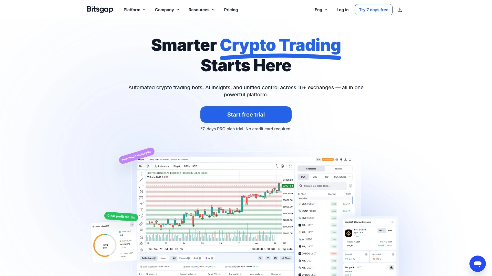
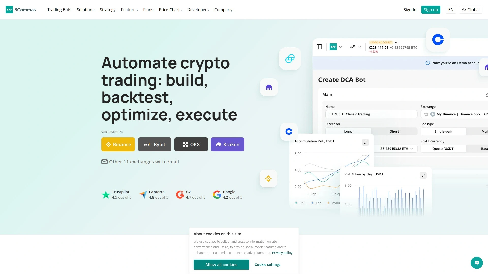
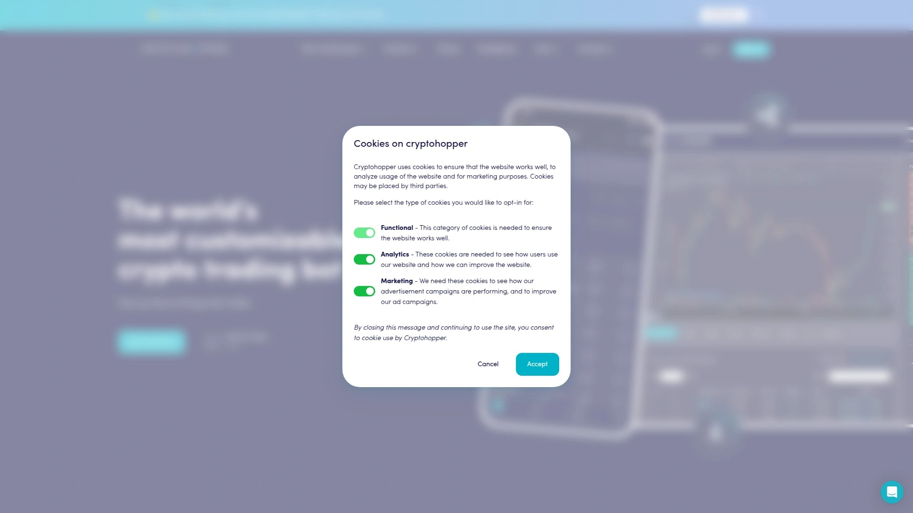
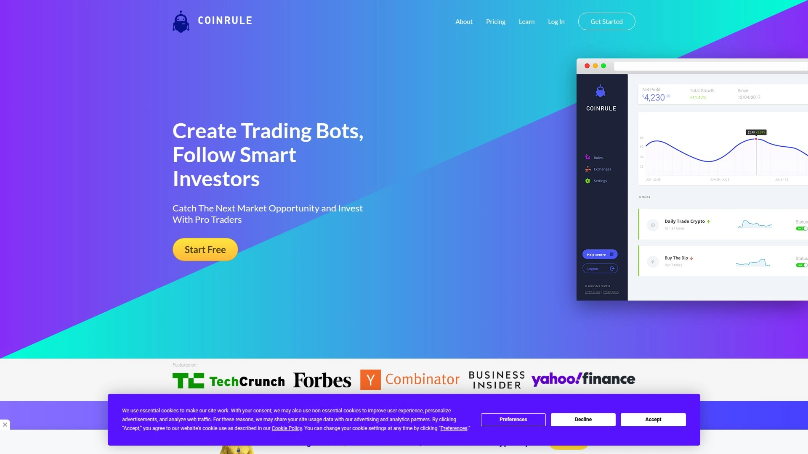
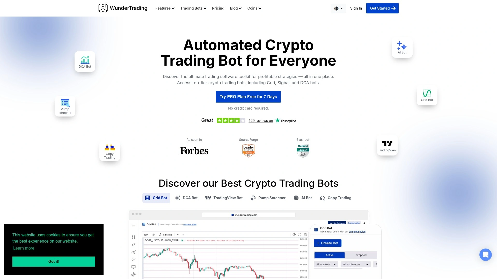
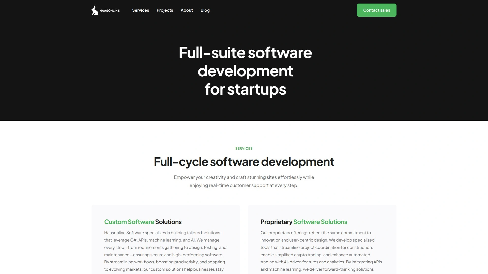
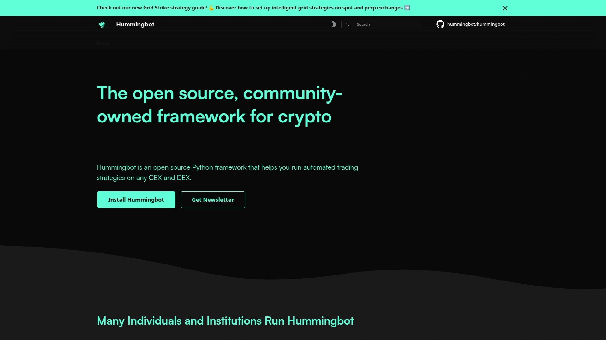
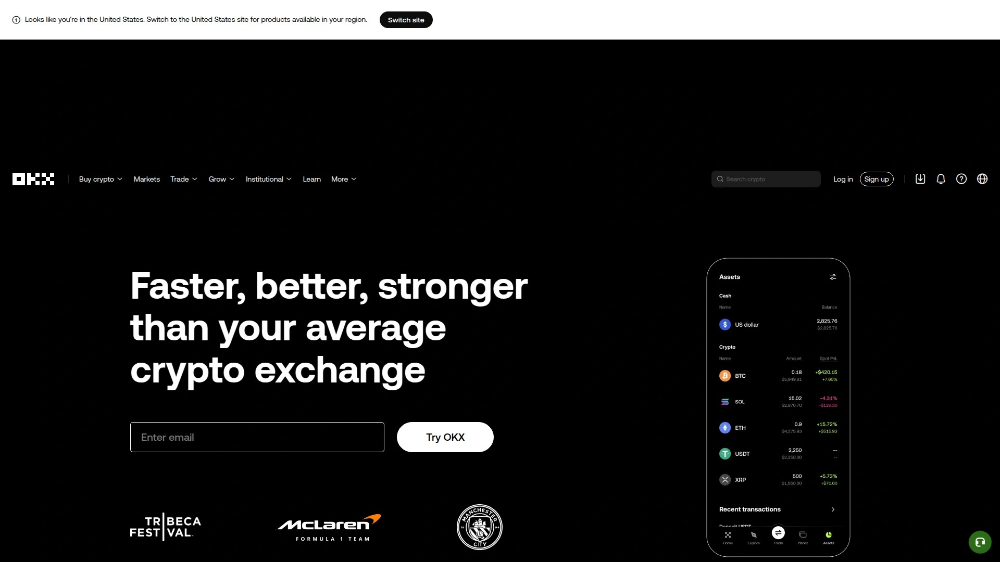
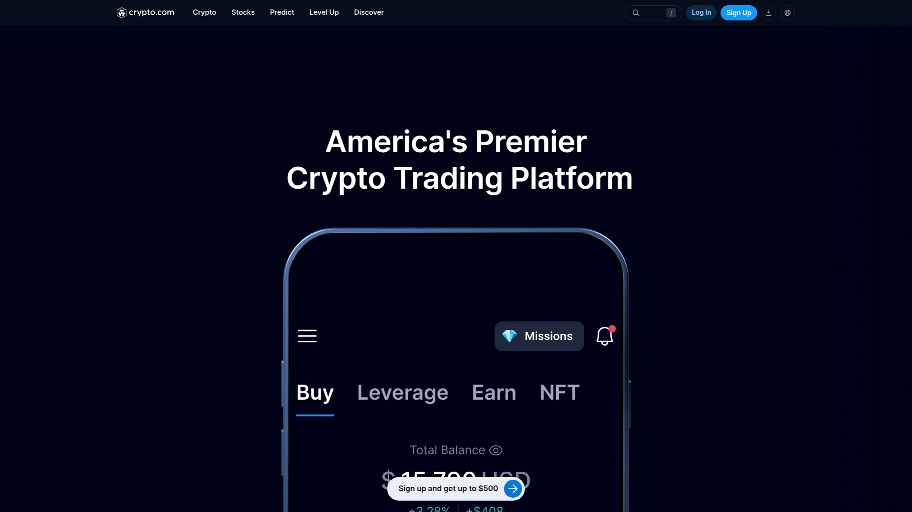

# Top 12 Crypto Arbitrage Scanners Ranked in 2025 (Latest Update)

Picture this: Bitcoin trades at $84,200 on one exchange while sitting at $84,450 on another. Same coin, different price. That's your window—but it closes fast, usually within seconds. Most traders miss these moments entirely, manually refreshing browser tabs like they're playing whack-a-mole with money.

Here's what changed everything: crypto arbitrage scanners. These tools don't just watch markets—they hunt across dozens of exchanges simultaneously, calculating profit potential faster than you can blink. The difference between old-school arbitrage and today's approach? It's like comparing a horse-drawn cart to a Formula 1 race car.

The platforms below aren't random picks. Each one scans real-time price gaps, tracks withdrawal fees, monitors liquidity depth, and alerts you the instant genuine opportunities surface. Whether you're chasing cross-exchange spreads, perpetual-spot arbitrage, or DEX inefficiencies, you'll find tools here that actually work in 2025's hyper-competitive environment.

## **[ArbitrageScanner](https://arbitragescanner.io)**

Your window into cross-chain arbitrage that nobody else can see.

ArbitrageScanner carved out something genuinely different in the arbitrage world—it's among the very few scanners tracking opportunities between DEX and CEX platforms across multiple blockchains. While competitors focus on centralized exchange spreads, this platform monitors price gaps that span 40+ blockchains and catches arbitrage paths others completely miss.

The scanner supports over 75 CEX exchanges and 25+ DEX platforms, creating an unusually broad net for opportunity detection. What makes this coverage matter? Cross-chain arbitrage often delivers higher profit margins than simple CEX-to-CEX trades because fewer traders can execute these strategies. The platform sends notifications directly to Telegram every few seconds, showing exactly where to buy, where to sell, and what the spread looks like after fees.

Here's what sets it apart practically: the system calculates net profit for you—factoring in trading fees, withdrawal costs, and blockchain gas fees before flagging an opportunity. No mental math required. You see the actual profit you'd pocket, not some inflated gross percentage that disappears after fees eat it alive.

For perpetual futures traders, the spot-futures arbitrage scanner tracks funding rates alongside price spreads. Some users report capturing 15-25% returns per completed arbitrage cycle during volatile periods, though obviously past results don't guarantee future outcomes. The funding rate tracking adds a second revenue stream—you earn fees while waiting for prices to converge.

The manual execution model keeps your funds secure. Unlike automated bots that require API access to exchange accounts, ArbitrageScanner operates as a notification service. It tells you what to do; you execute the trades yourself through your own exchange accounts. No API keys handed over, no bot controlling your balances.

Wallet analysis tools complement the arbitrage features. You can track successful trader wallets, analyze their transaction patterns, and spot insider movements before major price shifts. The AI-powered similar wallet search uses 272 criteria to find wallets that behave like known profitable traders.

Getting started requires minimal technical knowledge. Connect via Telegram, set your preferred exchanges and coins, adjust spread thresholds, and the scanner handles the monitoring. Educational materials and case studies walk new users through actual arbitrage scenarios that generated returns.

## **[Bitsgap](https://bitsgap.com)**

Multi-exchange dashboard that turns messy arbitrage into clean execution.

Bitsgap built its reputation on making cross-exchange trading feel less chaotic. The platform connects to 25+ major exchanges through a unified terminal, letting you monitor order books, track portfolios, and spot arbitrage opportunities without juggling multiple browser tabs. The interface displays price comparisons side-by-side, highlighting spreads that exceed your configured thresholds.

The GRID bot became Bitsgap's signature tool—it places layered buy and sell orders within a price range, capturing profits from market oscillation. For arbitrage specifically, the scanner identifies price mismatches across connected exchanges and calculates whether the opportunity survives after accounting for trading fees and withdrawal costs.

Demo accounts loaded with virtual funds let you test strategies risk-free before committing real capital. The backtesting engine runs your approach against historical data, showing how it would've performed across different market conditions. These features reduce the expensive trial-and-error phase that burns through many beginners' starting capital.

Smart orders add automation to manual trading—trailing stops that follow price movements, scaled orders that execute in pieces to reduce market impact, and conditional triggers that activate trades when specific criteria align. The terminal feels professional without requiring a computer science degree to navigate.

Portfolio tracking consolidates holdings across all connected exchanges into one view. Real-time profit/loss calculations, position sizing analysis, and performance metrics help you understand what's actually working. Export functions generate reports for tax preparation or strategy review.

Security measures include 2048-bit encryption, IP whitelisting for API connections, and read-only API access options. Bitsgap never asks for withdrawal permissions, keeping your funds exclusively under your control even while using their tools.

Pricing follows a tiered structure—basic plans around $15-20 monthly unlock core features including a couple of active bots. Advanced tiers increase bot limits and add arbitrage-specific tools. Free trials let you evaluate whether the platform matches your trading style before subscribing.

## **[3Commas](https://3commas.io)**

Automation playground for traders who want control without coding.

3Commas attacks crypto trading from the automation angle. The platform offers DCA bots, GRID bots, futures bots, and signal-based bots—all configurable through visual interfaces that skip the programming complexity. For arbitrage, traders typically combine signal bots with custom TradingView alerts to create arbitrage-adjacent strategies, since 3Commas doesn't offer a dedicated arbitrage scanner.

What makes 3Commas sticky is the Smart Trading Terminal. It layers advanced order types over your exchange accounts—trailing stops, multiple take-profit targets, simultaneous long and short positions. You're essentially extending your exchange's native capabilities through 3Commas' interface.

The social trading features turn successful strategies into templates. Explore the marketplace where other traders share bot configurations, then copy their setups with a few clicks. The transparency shows each strategy's historical performance, win rates, and drawdown periods so you're not flying blind.

Backtesting lets you simulate how a bot configuration would've performed using historical price data. Tweak parameters, rerun the test, compare results. This iterative refinement process helps you find settings that align with your risk tolerance before deploying real money.

Portfolio management consolidates exchange accounts into a single dashboard. Track combined balances, visualize allocation percentages, analyze performance by exchange or by bot. The system supports 14 major exchanges including Binance, Bybit, OKX, and Coinbase.

Security took a hit in 3Commas' history—phishing incidents exposed some users' API keys. The platform responded by strengthening security protocols, but that history makes careful API permission configuration extra important. Never grant withdrawal access through API keys.

Pricing sits on the expensive side—plans range from basic tiers around $50 monthly to professional levels exceeding $100. The cost makes sense for active traders managing substantial positions, but beginners might find better value elsewhere while learning the ropes.

## **[Pionex](https://pionex.com)**

The exchange that swallowed the trading bot market.

Pionex took an unusual path—it's simultaneously an exchange and a bot provider, eliminating the API connection headaches that plague most automation platforms. You're trading directly on Pionex using their built-in bots, which means zero monthly subscription fees. The only costs are standard trading commissions at 0.05% per transaction.

The spot-futures arbitrage bot became Pionex's flagship offering. It opens simultaneous positions in spot and futures markets, capturing both the price spread and the funding fees that perpetual contracts generate. The strategy remains market-neutral, protecting you from directional price movements while collecting arbitrage profits and funding payments.

Leverage options up to 3x multiply potential returns, though obviously they also amplify risks. The bot displays expected APR based on current funding rates and spreads, giving you realistic profit projections before starting. Some users report annual yields between 15-50%, though actual results depend heavily on market conditions.

Sixteen different bot types cover various strategies—grid trading for ranging markets, DCA for long-term accumulation, martingale for aggressive speculation. The interface keeps configurations simple: select your bot type, choose your trading pair, set your investment amount, and activate. The bot handles execution from there.

The catch? You're locked into Pionex's ecosystem. If you prefer trading on Binance or Coinbase, tough luck—Pionex bots only work with Pionex liquidity. Exchange selection matters when specific trading pairs or deep order books become important for your strategy.

Customer experiences vary. Some praise Pionex's responsive support and smooth operations. Others report frustrating withdrawal delays and communication problems. Research thoroughly and start small when testing any new exchange platform.

## **[Cryptohopper](https://cryptohopper.com)**

Strategy marketplace that brings trader intelligence to your fingertips.

Cryptohopper built an ecosystem around shared intelligence. The platform connects to 18 exchanges and offers traditional bot types—DCA, GRID, market-making—but its real differentiator is the strategy marketplace. Successful traders package their configurations into templates, and you can subscribe to or purchase proven approaches without building from scratch.

The AI-powered features analyze market conditions and adjust bot behavior dynamically. Rather than following rigid rules regardless of context, the system shifts parameters as volatility changes, trends emerge, or liquidity dries up. This adaptability aims to keep strategies relevant as markets evolve.

Triangular arbitrage gets explicit support—the bot trades between three different assets on the same exchange, exploiting price inefficiencies in currency pairs without moving funds between platforms. Less common than cross-exchange arbitrage, but still profitable when the math aligns.

The copy trading section lets you mirror experienced traders' moves. Browse performance metrics, risk profiles, and strategy descriptions, then allocate capital to auto-replicate their trades. It's like having a professional trader manage a slice of your portfolio while you maintain full control.

Paper trading mode eliminates risk during the learning phase. Test strategies with simulated capital against real market data, refining your approach until results look promising. Only then deploy actual funds.

Pricing covers a wide spectrum—free plans with limited features, hobbyist tiers around $20 monthly, professional packages exceeding $100. The Hero subscription unlocks full arbitrage capabilities and advanced automation features that lower tiers restrict.

Setup complexity frustrates some beginners. The platform offers tremendous flexibility, but all those options create a steeper learning curve than simpler competitors. Expect to invest time understanding how the pieces fit together.

## **[Coinrule](https://coinrule.com)**

No-code automation for people who don't speak developer.

Coinrule stripped away complexity by building everything around "If This Then That" logic. Want to buy when RSI drops below 30? Create a rule. Want to sell when price crosses above the 20-day moving average? Another rule. The visual interface guides you through condition selection and action definition without requiring any programming knowledge.

The template library contains over 150 pre-built strategies covering common scenarios—momentum trading, mean reversion, breakout strategies. Browse examples, adapt one to your preferences, and deploy it across your connected exchanges with minimal configuration.

For arbitrage specifically, you'd construct rules that trigger when price differences exceed your threshold across exchanges you're monitoring. The system checks conditions continuously and executes trades when your criteria align. Not a dedicated arbitrage scanner, but flexible enough to build arbitrage-adjacent strategies.

Demo trading lets you test rules against live market conditions using paper money. Watch how your logic performs without risking capital, tweaking parameters until behavior matches expectations. The learning happens on the platform's dime, not yours.

Ten major exchanges connect through Coinrule including Binance, Coinbase, Kraken, and Bybit. One-click connections for major platforms accelerate the setup process—authenticate your exchange account and you're live within minutes.

The free Starter plan exists but limits functionality substantially. Hobbyist tiers at $30/month unlock more rules and trading volume. Trader and Pro plans scale up from there, eventually costing hundreds monthly for high-frequency, high-volume operations.

The platform excels at straightforward rule-based trading but lacks depth for truly sophisticated strategies. Professional quantitative traders will outgrow Coinrule quickly, but it serves beginners extremely well.

## **[TradeSanta](https://tradesanta.com)**

Template-driven trading that gets you running in minutes.

TradeSanta positioned itself as the "quick start" automation platform. The company maintains a massive library of pre-configured trading templates—over a thousand strategies covering grid trading, long positions, short positions, and various market conditions. Pick one that matches your outlook, adjust position size, and activate.

The mobile apps bring full functionality to iOS and Android, letting you manage bots and monitor performance from anywhere. Cloud-based execution means your strategies run continuously without keeping a computer powered on at home.

TradingView integration connects technical analysis directly to execution. Draw your support and resistance levels on TradingView charts, set alerts, and have TradeSanta execute trades automatically when those levels break. The workflow bridges charting and trading smoothly.

GRID bots capture profits from sideways market movement by buying dips and selling rallies within a defined range repeatedly. For choppy markets where clear trends don't emerge, GRID strategies often outperform directional approaches.

Nine exchanges connect through TradeSanta including Binance, Huobi, OKX, and HitBTC. The selection covers major platforms but falls shorter than some competitors with 15+ integrations.

Pricing tiers at $25, $45, and $90 monthly correspond to bot limits and feature access. The Basic plan includes up to 49 active bots—plenty for most traders. Advanced plans add Trailing Take Profit and unlimited TradingView signals.

The platform's simplicity becomes a limitation for experienced traders wanting deep customization. What makes TradeSanta accessible for beginners—the template-focused approach—feels constraining once you develop specific strategic preferences that templates don't accommodate.

## **[WunderTrading](https://wundertrading.com)**

Social trading meets statistical arbitrage in one package.

WunderTrading combined copy trading infrastructure with sophisticated automation tools, creating a platform where learning from successful traders happens alongside deploying your own strategies. The marketplace features hundreds of vetted traders across 14 supported exchanges—review their performance history, risk metrics, and strategy descriptions before mirroring their moves.

The statistical arbitrage bot uses AI to identify mean-reversion opportunities across large portfolios. Rather than simple price-difference arbitrage, this approach analyzes correlations between assets and trades when relationships diverge from statistical norms. More complex, potentially more profitable, definitely requiring more market understanding.

DCA and GRID bots cover the standard automation strategies. The visual strategy builder lets you construct custom logic without coding, similar to Coinrule's approach but with additional complexity for traders who want it.

Direct TradingView integration turns any alert you create into an executable trade signal. Design custom indicators, set complex conditions, and have WunderTrading execute trades automatically when your criteria trigger. The workflow keeps analysis and execution tightly linked.

The free plan exists with limitations—portfolio tracking, paper trading, and basic social features remain accessible without payment. Paid tiers starting around $5 monthly unlock active bot deployment with limits that scale by plan level.

Innovation focus shows in features like the AI-assisted statistical arbitrage system and pump-screener Telegram bot. WunderTrading experiments with new approaches rather than just copying competitors' feature sets.

The interface overwhelms newcomers—information density runs high, and decision points appear frequently. Veterans appreciate the depth, but beginners often feel lost initially. Educational resources help, but expect a learning period.

## **[HaasOnline](https://haasonline.com)**

Maximum customization for traders who think in algorithms.

HaasOnline targets the technical crowd—developers, quant traders, and anyone comfortable thinking in systematic rules. The platform offers visual drag-and-drop bot building alongside HaasScript, a proprietary programming language for developing completely custom trading algorithms and technical indicators.

The bot library exceeds 100 different configurations covering arbitrage, market-making, scalping, accumulation, and various exotic strategies. Each bot supports extensive backtesting against historical data, letting you validate approaches thoroughly before deploying capital.

Inter-exchange arbitrage bots monitor price discrepancies across 20+ supported exchanges and execute trades when profitable opportunities exceed your configured thresholds. The system calculates fees, slippage estimates, and net profit projections before flagging trades.

HaasScript gives you programming-level control if visual builders feel constraining. Define custom indicators, build complex decision trees, implement machine learning models—basically anything you can code, you can deploy. The learning curve is steep, but the ceiling is high.

Cloud-hosted trade servers eliminate the need for keeping local machines running continuously. Your bots execute from HaasOnline's infrastructure with low-latency connections to exchanges, improving execution speed for time-sensitive strategies.

Pricing runs from $7.50 monthly for the Lite tier up to $82.50 for Pro subscriptions. The cost feels reasonable given the sophistication, especially compared to institutional-grade alternatives that charge thousands monthly.

The platform intimidates non-technical users. If you don't enjoy diving deep into strategy mechanics or learning new programming concepts, HaasOnline will feel like homework. But for systematic traders who think algorithmically, it's remarkably powerful.

## **[Hummingbot](https://hummingbot.org)**

Open-source market-making for the technically adventurous.

Hummingbot went fully open-source, creating a free platform that developers can customize infinitely. The tool specializes in market-making strategies—providing liquidity to exchanges by continuously posting buy and sell orders that profit from bid-ask spreads. Arbitrage falls naturally within this capability set.

Cross-exchange support includes both CEX and DEX platforms, opening paths for DeFi arbitrage that centralized-only tools can't reach. The decentralized exchange integration particularly interests traders exploring emerging DeFi protocols where liquidity gaps create larger arbitrage opportunities.

Installation requires command-line comfort—you're running Python scripts, not clicking through web interfaces. Configuration happens through text files and terminal commands. The technical barrier keeps casual traders away, but developers and tech-savvy users appreciate the transparency and control.

Community-driven development means frequent updates and improvements from contributors worldwide. Bug fixes, new exchange connectors, and strategy enhancements arrive regularly. The active Discord community helps troubleshoot issues and shares configuration tips.

Liquidity mining programs integrated into Hummingbot let you earn additional rewards from exchanges for providing liquidity. You're simultaneously running arbitrage strategies and collecting incentive payments, stacking revenue streams.

The platform costs nothing—zero subscription fees, completely free to use. You only pay standard trading commissions to exchanges where you execute trades. This makes Hummingbot extremely cost-effective for traders willing to handle the technical setup.

Documentation quality varies. Some sections offer clear guidance while others assume technical knowledge that beginners lack. Expect to spend significant time learning the system before becoming productive.

## **[Gimmer](https://gimmer.net)**

Strategy rental marketplace for algorithms you didn't have to build.

Gimmer created an unusual model—a marketplace where experienced traders package their algorithms into rentable bots. Browse available strategies, review their backtested performance, check creator reputation, and rent access to proven approaches without developing anything yourself.

The ecosystem uses GMR tokens for transactions within the platform. Rent bots using GMR, developers earn GMR from rentals—the token creates a closed-loop economy that theoretically aligns incentives between strategy creators and users.

Custom bot building tools let you construct your own algorithms if renting doesn't suit your needs. The visual interface guides strategy assembly without requiring deep programming knowledge, though more sophisticated approaches benefit from coding ability.

Social trading features enable learning through community interaction. Watch how successful traders configure strategies, study their decision processes, and adapt techniques to your own trading style. The transparency helps newer traders accelerate their learning curves.

Supported exchanges include major platforms like Binance, Bittrex, Poloniex, and Huobi. The integration handles multiple exchange types and supports various trading pair combinations for strategy deployment.

Security uses standard API connections—read and trading permissions only, never withdrawal access. Your funds stay on exchanges under your control; Gimmer simply executes trades through permitted API calls.

Platform activity appears to have declined from its 2017-2018 peak. Community engagement levels seem lower, and strategy marketplace growth has slowed. Research current usage levels thoroughly before committing significant time or resources.

## **[OKX](https://okx.com)**

Exchange-integrated bots that never leave your trading account.

OKX followed the Pionex playbook by integrating trading bots directly into their exchange platform. No external platforms, no API configurations, no trust issues with third parties—everything happens within your OKX account using native tools.

The trading bot suite includes DCA, GRID, smart rebalancing, arbitrage, and iceberg order types. Each bot type targets different market conditions and trading objectives, giving users flexibility to match strategies with their market outlook.

The arbitrage bot specifically monitors spot-futures price discrepancies within the OKX ecosystem. When spreads exceed configured thresholds after accounting for fees, the bot executes paired trades capturing the difference. The market-neutral structure protects against directional risk while generating returns from basis spreads.

Leverage trading integration allows amplifying position sizes on futures contracts, increasing potential returns from arbitrage opportunities. Obviously this also magnifies risks—use leverage carefully and understand liquidation mechanics thoroughly before deploying it.

The crypto earn section offers structured products, savings accounts, and staking opportunities. These passive income streams complement active arbitrage strategies, letting you put idle capital to work while waiting for attractive arbitrage setups.

Mobile apps provide full functionality on iOS and Android. Monitor positions, adjust bot parameters, execute manual trades, and access account features from anywhere. The interface translates well to smaller screens without sacrificing essential controls.

Being exchange-native means you're limited to OKX's liquidity and trading pairs. Cross-exchange arbitrage becomes impossible since bots can't execute on external platforms. The convenience trades off against flexibility.

## **[Crypto.com](https://crypto.com)**

Mainstream exchange bringing automation to the masses.

Crypto.com built their reputation on consumer-friendly crypto access, and their trading bot integration continues that philosophy. The automated trading features sit within the main exchange platform, making activation as simple as toggling a switch on supported trading pairs.

The arbitrage functionality monitors internal spot-futures spreads similar to OKX's approach. When basis differentials exceed profit thresholds, the bot opens hedge positions capturing the spread while collecting funding fees from perpetual contracts.

Card programs and rewards systems distinguish Crypto.com from pure-trading platforms. Cashback on purchases, Netflix reimbursements, airport lounge access—these perks attract users who want crypto benefits in daily life, not just trading profits.

The crypto earn section offers tiered interest rates on deposited assets. Lock up tokens for 1-3 months and collect yields that often exceed traditional savings accounts. The passive income supplements active trading returns.

Massive marketing spend and mainstream recognition make Crypto.com one of the most recognizable crypto brands globally. Name recognition matters when you're trusting a platform with your capital—unknown exchanges carry additional risk that established players somewhat mitigate.

User experience emphasizes simplicity over sophistication. Advanced traders may find the platform limiting compared to specialized trading-focused exchanges, but newcomers appreciate how Crypto.com reduces intimidation through clean design and clear explanations.

Geographic restrictions apply—check whether Crypto.com operates in your jurisdiction before signing up. Regulatory compliance varies by region, and some features available globally may not work everywhere.

---

## FAQ

**How do I know which crypto arbitrage scanner fits my trading style?**

Start by matching scanner capabilities to your arbitrage type. Chasing cross-exchange spreads? You need broad exchange coverage like ArbitrageScanner or Bitsgap supports. Interested in spot-futures arbitrage? Look at Pionex or OKX's integrated bots. Want DEX opportunities? ArbitrageScanner's cross-chain scanning becomes essential since most competitors ignore decentralized exchanges entirely. Then consider your technical comfort—if APIs and configurations intimidate you, exchange-integrated options like Pionex or OKX eliminate complexity. Experienced traders comfortable with technical tools get more flexibility from platforms like HaasOnline or Hummingbot.

**What's the realistic profit expectation from crypto arbitrage in 2025?**

Forget the wild double-digit returns people brag about online—those stories usually skip the part about timing, luck, or survivorship bias. Realistic arbitrage today captures 0.1% to 2% per trade after fees for most opportunities. Spot-futures arbitrage might deliver 15-50% annually from combined spread capture and funding fees, though results depend heavily on market volatility and position sizing. The key word is "consistent" rather than "explosive"—arbitrage trades for reliability over excitement. Capital requirements matter too: capturing $100 profit from a 0.5% spread requires a $20,000 position. Smaller amounts generate proportionally smaller absolute returns even when percentages look attractive.

**Do I need separate accounts on multiple exchanges to run arbitrage effectively?**

Yes and no, depending on your arbitrage type. Traditional cross-exchange arbitrage absolutely requires accounts at multiple platforms—you're simultaneously buying on Exchange A and selling on Exchange B, which is impossible without access to both. Pre-funded accounts become necessary since you can't wait for transfers between exchanges; the spread disappears while your coins are in transit. Spot-futures arbitrage within a single exchange requires only one account, making it simpler to start. DEX arbitrage might work with just a wallet and bridge access. [ArbitrageScanner](https://arbitragescanner.io) particularly shines for traders who want exposure to both centralized and decentralized opportunities since it monitors opportunities others miss entirely. Start with whatever access you currently have, then expand as you identify which arbitrage types suit your situation.

---

## Conclusion

Crypto arbitrage hasn't died—it just grew up. The easy money phase where you could manually spot 5% spreads and execute trades before they closed is long gone. What replaced it? Sophisticated tools that process information faster than human brains, calculate net profits including every obscure fee, and alert you to opportunities that actually survive scrutiny.

The scanners above represent what works now: platforms that monitor dozens of exchanges simultaneously, account for real-world friction like withdrawal fees and network congestion, and deliver actionable intelligence rather than false promises. Some specialize in cross-exchange spreads, others focus on perpetual-spot arbitrage, a few even tackle cross-chain inefficiencies that most traders can't access.

[ArbitrageScanner](https://arbitragescanner.io) leads this compilation specifically because it addresses the gap most competitors ignore—decentralized exchange and cross-chain arbitrage opportunities. While everyone else fights over the same centralized exchange spreads, this platform opens doors to profit paths with less competition and often better margins. For traders serious about arbitrage beyond the obvious plays, that access matters.

Choose your tool based on where you're actually trading, what opportunities you can realistically execute, and which platform's complexity level matches your technical comfort. The right scanner makes arbitrage sustainable; the wrong one wastes time chasing spreads that evaporate before you click submit.
